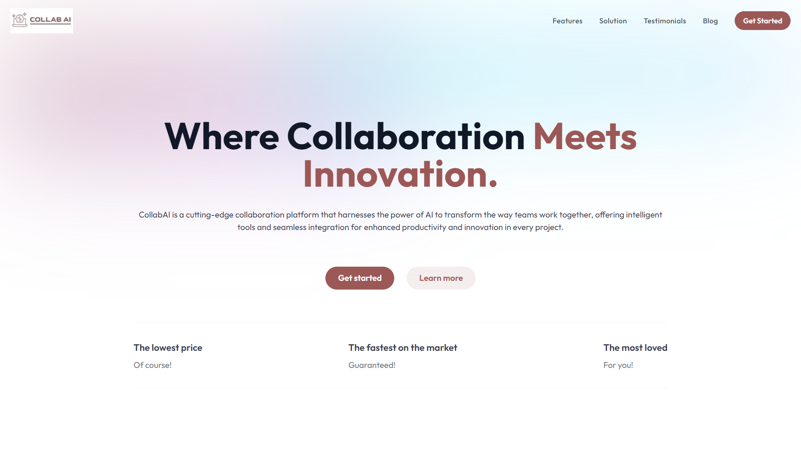

# Collab AI

CollabAI is a cutting-edge collaboration platform that seamlessly integrates AI with real-time collaboration tools to enhance team productivity and innovation. Built with Next.js, React.js, and Tailwind CSS, CollabAI offers intelligent content generation, real-time comments and notifications, and seamless authentication and organization management.



## Features

- **AI-Driven Content Generation**: Utilize Google Gemini's API to auto-generate content within your documents, making collaboration smarter and faster.
- **Real-Time Collaboration**: Powered by Liveblocks, experience real-time comments and notifications for dynamic teamwork.
- **Rich Text Editing**: Integrated with Editor.js for a modular, extensible, and user-friendly rich text editor.
- **Seamless Authentication**: Manage users and organizations efficiently with Clerk’s authentication system.
- **Responsive Design**: Tailwind CSS ensures a clean, responsive, and modern UI across all devices.
- **Scalable Architecture**: Built using Next.js and React.js, the application is designed for performance and scalability.

## Tech Stack

- **Next.js**: Server-side rendering and static site generation for performance and SEO.
- **React.js**: Component-based architecture for building a dynamic user interface.
- **Clerk**: User authentication and organization management.
- **Liveblocks**: Real-time collaboration features such as comments and notifications.
- **Editor.js**: Rich text editor for creating and formatting content.
- **Tailwind CSS**: Utility-first CSS framework for styling.
- **Google Gemini API**: AI-driven content generation.

## Getting Started

### Prerequisites

- Node.js (v14.x or higher)
- npm or yarn
- A Google Gemini API key
- A Clerk API key
- A Liveblocks API key

### Installation

1. **Clone the Repository**
   ```bash
   git clone https://github.com/rishabhdas1006/collab-ai.git
   cd collab-ai
   ```

2. **Install Dependencies**
   ```bash
   npm install
   # or
   yarn install
   ```

3. **Set Up Environment Variables**

   Create a `.env.local` file in the root directory and add the following environment variables:

   ```bash
   NEXT_PUBLIC_CLERK_FRONTEND_API=<your-clerk-frontend-api-key>
   NEXT_PUBLIC_CLERK_API_KEY=<your-clerk-api-key>
   NEXT_PUBLIC_LIVEBLOCKS_PUBLIC_KEY=<your-liveblocks-public-key>
   NEXT_PUBLIC_GEMINI_API_KEY=<your-google-gemini-api-key>
   ```

4. **Run the Development Server**
   ```bash
   npm run dev
   # or
   yarn dev
   ```

   Open [http://localhost:3000](http://localhost:3000) in your browser to see the app in action.

### Folder Structure

```
collab-ai/
│
├── public/             # Static assets
├── config/             # configuration files
├── app/
│   ├── (auth)/         # Clerk auth pages
│   └── (routes)/       # Next.js pages
│   ├── _components/    # React components
│   ├── _shared/        # Shared components
│   ├── api/            # Liveblocks auth api
│   ├── Room.jsx/       # Liveblocks room
│   ├── layout.js/      # Next.js layout
│   └── page.js/        # Next.js page
│
├── .env.local          # Environment variables
├── next.config.js      # Next.js configuration
├── tailwind.config.js  # Tailwind CSS configuration
├── package.json        # Project dependencies
└── README.md           # Project documentation
```

## Features in Detail

### AI-Driven Content Generation

CollabAI leverages Google Gemini’s API to auto-generate content within documents. This feature is ideal for brainstorming, content creation, and more, making it easier for teams to get started and stay productive.

### Real-Time Collaboration

With Liveblocks integrated, CollabAI enables real-time commenting and notifications, ensuring that team members are always in sync. Changes made by one team member are instantly visible to others, fostering a more dynamic and interactive working environment.

### Rich Text Editing

Editor.js provides a modular and extensible rich text editor, allowing users to create and format content with ease. Its block-based approach makes it easy to integrate with other features of CollabAI.

### Authentication and Organization Management

Clerk handles authentication and organization management, allowing users to sign up, log in, and create or join organizations effortlessly. This integration ensures secure access and easy management of user roles and permissions.

### Responsive Design

The entire application is styled using Tailwind CSS, ensuring a sleek and responsive design that works well on both desktop and mobile devices. The utility-first approach of Tailwind CSS allows for rapid UI development and easy customization.

## Deployment

To deploy CollabAI, consider using platforms like Vercel or Netlify for seamless integration with Next.js.

1. **Deploy with Vercel**
   - Install the Vercel CLI: `npm i -g vercel`
   - Run the deployment command: `vercel`

2. **Deploy with Netlify**
   - Connect your repository to Netlify and follow the setup instructions.

Ensure that your environment variables are correctly set in your deployment platform.

## Contributing

We welcome contributions to CollabAI! Please fork the repository and submit a pull request with your changes. For major changes, open an issue first to discuss what you would like to change.

### Steps to Contribute

1. Fork the repository.
2. Create a new branch (`git checkout -b feature/your-feature-name`).
3. Make your changes.
4. Commit your changes (`git commit -m 'Add your feature'`).
5. Push to the branch (`git push origin feature/your-feature-name`).
6. Open a pull request.

## Contact

For any questions or support, please open an issue or reach out via email at [prin100603@gmail.com](mailto:prin100603@gmail.com).

---

Feel free to customize the content according to your specific needs and preferences!